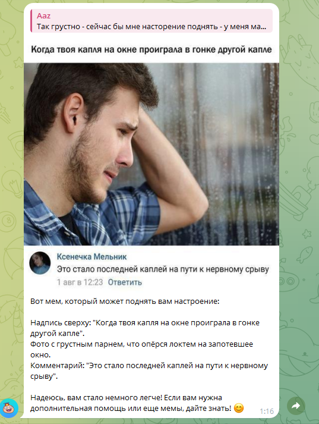

```markdown
# 🤖 Kent - ваш AI-помощник для поднятия настроения и поиска мест 🌟



Лучший друг, который всегда поддержит мемом, найдет интересные места вокруг и даже поможет с бронированием!

## 🎭 Основные возможности

- **🔍 Поиск мест**  
  Рестораны, спа, кафе и другие интересные локации с учетом ваших предпочтений
- **📅 Бронирование столиков**  
  Отправка SMS через интеграцию с MTS Exolve
- **💬 Умная коммуникация**  
  Генерация сообщений для друзей/коллег прямо в Telegram
- **🎙️ Голосовое взаимодействие**  
  Поддержка голосовых сообщений (Speech-to-Text)
- **❤️ Персонализация**  
  Запоминание пищевых предпочтений в SQLite
- **🖼️ Мемотерапия**  
  Персональная подборка мемов под ваше настроение

## 🛠️ Технологический стек

| Компонент             | Технологии/Сервисы                  |
|-----------------------|--------------------------------------|
| **Ядро AI**           | GPT-4o (OpenAI)                     |
| **Фреймворк**         | aiogram (Telegram Bot)              |
| **Распознавание речи**| SpeechRecognition                   |
| **База данных**       | SQLite                              |
| **Внешние API**       | Google Maps, MTS Exolve SMS Gateway |

## 🚀 Быстрый старт

### Локальная установка

1. **Клонируйте репозиторий**
   ```bash
   git clone https://github.com/AnyashaTk/MyKent.git
   cd MyKent
   ```

2. **Установите зависимости**
   ```bash
   pip install -r requirements.txt
   ```

3. **Настройте окружение**  
   Создайте `.env` файл с ключами:
   ```ini
   OPENAI_API_KEY=ваш_ключ
   GOOGLE_MAPS_API_KEY=ваш_ключ
   MTS_EXOLVE_API_KEY=ваш_ключ
   ```

4. **Инициализируйте БД**
   ```bash
   python db_setup.py
   ```

5. **Запустите бота**
   ```bash
   python agent_gpt.py
   ```

### Запуск через Docker

1. **Соберите образ**
   ```bash
   docker build -t kent-bot .
   ```

2. **Запустите контейнер**
   ```bash
   docker run -it \
   -e OPENAI_API_KEY=your_key \
   -e GOOGLE_MAPS_API_KEY=your_key \
   -e MTS_EXOLVE_API_KEY=your_key \
   kent-bot
   ```

## 📂 Структура проекта

```
MyKent/
├── data/                  # Медиа-ресурсы и статические файлы
├── agent_free.py          # тклкграмная обертка
├── agent_gpt.py           🤖 Основной скрипт бота (GPT-4o)
├── db_operations.py       🗃️ Работа с базой данных
├── db_setup.py            🛠️ Инициализация БД
├── MemeRecommender.py     🎭 Система рекомендации мемов
├── stt.py                 🎤 Модуль распознавания речи
├── user_memory.db         💾 База данных пользователей
├── requirements.txt       📦 Зависимости
├── Dockerfile             🐳 Конфигурация Docker
└── README.md              📖 Этот файл
```

## 📞 Примеры использования

```python
# Поиск ресторанов рядом
await search_places(location="Москва", type="ресторан")

# Генерация SMS для бронирования
generate_booking_sms(name="Кафе 'У Ашота'", time="19:00")

# Рекомендация мема по настроению
get_meme_recommendation(user_id=123, mood="грустно")
```

## 🌟 Особенности реализации

- **Агентная архитектура**: Автономное принятие решений на основе контекста
- **Кэширование предпочтений**: Адаптация к пользователю через SQLite
- **Мультимодальность**: Поддержка текста/голоса/медиа
- **Интеграция с Telegram**: Полноценный интерфейс через aiogram

## 🔧 Требования

- Python 3.9+
- Активные API-ключи для:
  - OpenAI (GPT-4o)
  - Google Maps
  - MTS Exolve (SMS)

## 📄 Лицензия

MIT License © 2024 [AnyashaTk](https://github.com/AnyashaTk), [PikaChuChuMF](https://github.com/PikaChuChuMF)

> **Note**  
> Для работы всех функций необходимы активные API-ключи.  
> Бот предназначен для образовательных целей.

[](https://t.me/your_bot_link)
```